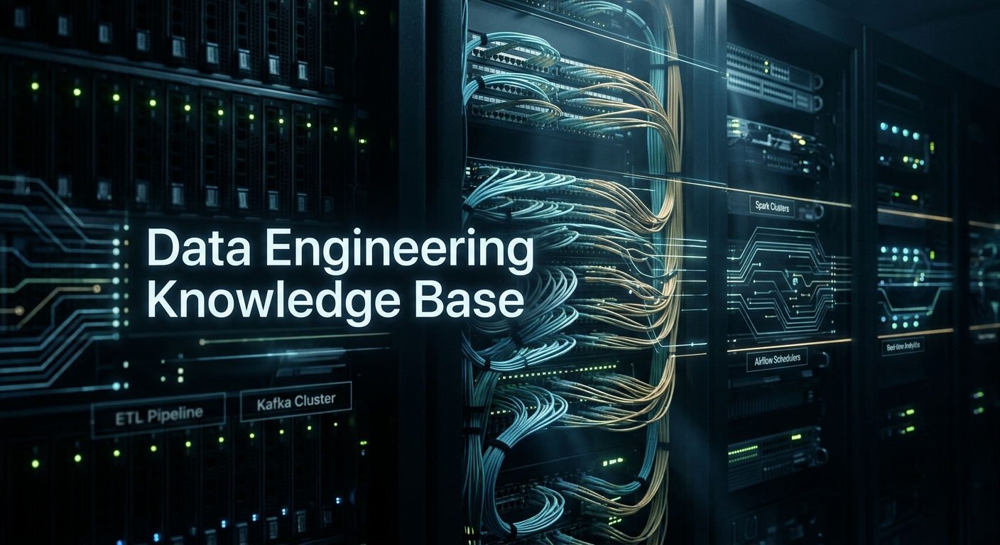

# Data Engineering Knowledge Base

A persistent, source-driven wiki for designing, building, operating, and governing modern data systems. Raw documents are synthesized into durable topic pages so each ingest strengthens the existing body of knowledge instead of creating an isolated summary.

## Knowledge map

### Foundations and architecture

- [Foundations](Foundations/index.md) — core terminology, principles, and the data engineering lifecycle.
- [Architecture](Architecture/index.md) — distributed-system structure, component selection, and architectural styles.
- [Data Modeling](DataModeling/index.md) — logical, dimensional, Data Vault, and semantic modeling.
- [Design Patterns](DesignPatterns/index.md) — reusable patterns, tradeoffs, and anti-patterns.
- [Reference Architectures](ReferenceArchitecture/index.md) — end-to-end blueprints connecting platform components.

### Storage and processing

- [Storage and Table Formats](StorageFormats/index.md) — files, table formats, catalogs, and interoperability.
- [Lakehouse](Lakehouse/index.md) — lakehouse principles, components, and implementations.
- [Data Warehousing and OLAP](DataWarehousing/index.md) — warehouses, analytical databases, and serving engines.
- [Batch Processing](BatchProcessing/index.md) — large-scale bounded processing engines and patterns.
- [Stream Processing](StreamProcessing/index.md) — event streams, real-time computation, state, and time semantics.

### Movement, delivery, and consumption

- [Data Integration and Ingestion](DataIntegration/index.md) — ETL/ELT, CDC, connectors, replication, and movement.
- [Orchestration](Orchestration/index.md) — scheduling, dependencies, backfills, and workflow engines.
- [Analytics and Serving](AnalyticsServing/index.md) — BI, metrics, APIs, query layers, and data products.
- [Data Platforms](DataPlatforms/index.md) — managed services, integrated products, and internal platforms.

### Trust and operations

- [Data Quality and Contracts](DataQuality/index.md) — validation, testing, contracts, SLOs, and reliability.
- [Metadata, Catalog, and Lineage](MetadataCatalog/index.md) — discovery, semantics, lineage, and metadata management.
- [Governance, Privacy, and Security](GovernanceSecurity/index.md) — ownership, policy, access, privacy, and compliance.
- [Observability](Observability/index.md) — monitoring data health, pipelines, dependencies, and incidents.
- [DataOps and Delivery](DataOps/index.md) — SDLC, CI/CD, environments, deployment, and operations.
- [Performance and Cost](PerformanceCost/index.md) — tuning, capacity, workload management, and FinOps.
- [Production Best Practices](BestPractices/index.md) — cross-cutting guidance synthesized across sources.

### Ecosystem and evidence

- [Standards](Standards/index.md) — open specifications, protocols, and interoperability standards.
- [Research](Research/index.md) — papers, surveys, and emerging techniques.
- [Benchmarks](Benchmarks/index.md) — workloads, datasets, results, and methodological caveats.
- [AI for Data Engineering](DevAgents/index.md) — agents and LLM-assisted engineering workflows.
- [Learning Resources](LearningResources/index.md) — curated books, courses, newsletters, and learning paths.

## How the wiki compounds

1. Drop an immutable source into `raw/`.
2. Ask an agent to ingest pending sources; `AGENTS.md` defines the extraction and filing rules.
3. The agent integrates supported knowledge into one or more topical pages, adds references and cross-links, updates navigation and logs, and validates the site.
4. `.ingest-state.json` records the source hash and affected pages, allowing changed and unprocessed files to be detected reliably.

Run `python3 scripts/raw-status.py` at any time to see the raw-source queue.

## Disclaimer

*This knowledge base includes images, diagrams, and visual references sourced or adapted from external articles, research papers, vendor documentation, and publicly available materials. All such visuals remain the property of their respective owners and are used for educational, reference, and illustrative purposes only. Where applicable, original sources are cited or referenced, and no claim of ownership is made over third-party content.*

## License

This project is licensed under the Apache License 2.0.

## Acknowledgments

This knowledge base builds upon the incredible work of the open source community, academic researchers, and industry practitioners who continue to advance the field of agentic AI. Special thanks to all contributors and the organizations that have shared their research and insights publicly.

## Contributor

**Ankur Kumar** has contributed to building this knowledge base.

---

**GitHub Repository**: [https://github.com/ankurkumarz/data-engineering-knowledge-base](https://github.com/ankurkumarz/agentic-ai-knowledge-base/)